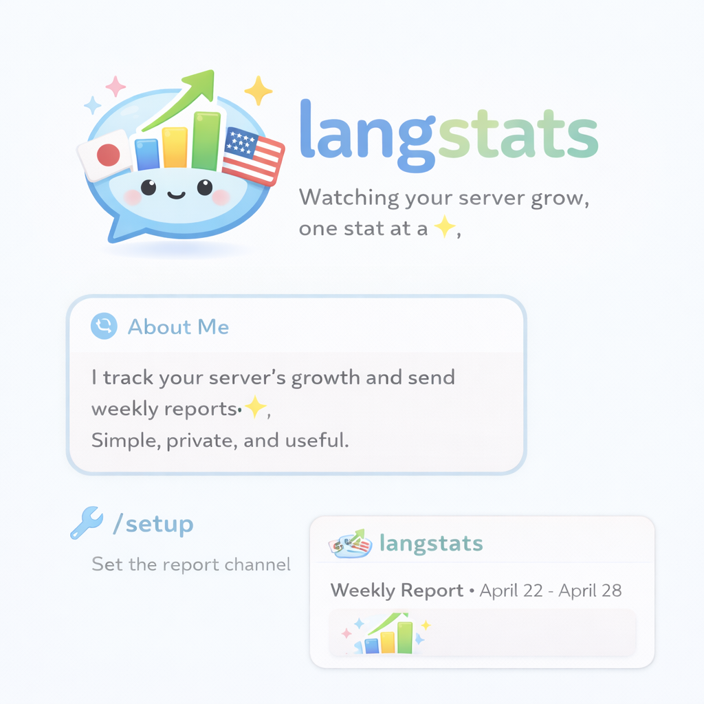

<p align="center">
  
</p>

<h1 align="center">LangStats</h1>

<p align="center">
  <strong>Watching your server grow, one stat at a time</strong>
</p>

<p align="center">
  
  
  
  
</p>

<p align="center">
  <a href="#features">Features</a> •
  <a href="#quick-start">Quick Start</a> •
  <a href="#development">Development</a>
</p>

---

## About

LangStats is a Discord bot that tracks your server's growth and sends weekly reports.
Simple, private, and useful.

Built for language exchange communities, but works for any Discord server.

## Features

| Feature | Description |
|---------|-------------|
| **Daily Stats** | Records member count and language role stats every day |
| **Weekly Report** | Automatically posts growth reports every Monday (no manual work) |
| **`/setup`** | Set the channel for weekly reports |
| **`/preview`** | Preview the current report before it's posted |

### Weekly Report Example

> Example output (numbers are sample data)

```
📊 Weekly Growth Report - Language Exchange Hub
━━━━━━━━━━━━━━━━━━━━━━━━━━━━━━

👥 Members: 482 (+12)
📈 Growth: +2.5%

🏷️ Language Roles:
   English Learners: 156 (+5)
   Japanese Learners: 89 (+3)
   Spanish Learners: 45 (+1)

💡 Insight: Learner roles grew faster than native roles this week.

━━━━━━━━━━━━━━━━━━━━━━━━━━━━━━
```

## Quick Start

1. **Add the bot to your server**

   [Add LangStats to Discord](https://discord.com/oauth2/authorize?client_id=1466321163792945183&permissions=68608&integration_type=0&scope=bot+applications.commands)

2. **Set the report channel**

   Use `/setup` to choose where weekly reports will be posted.

3. **Wait for your first report**

   Your first report will be posted automatically next Monday.

## Development

### Tech Stack

- **Runtime**: Node.js 20
- **Bot Framework**: discord.js
- **Database**: Turso (SQLite)
- **ORM**: Drizzle ORM
- **Scheduler**: GitHub Actions

### Setup

```bash
# Install dependencies
pnpm install

# Copy environment variables
cp .env.example .env

# Edit .env with your credentials
# - DISCORD_TOKEN
# - DISCORD_CLIENT_ID
# - TURSO_DATABASE_URL
# - TURSO_AUTH_TOKEN

# Run database migrations
pnpm db:push

# Start the bot
pnpm dev
```

### Scripts

| Script | Description |
|--------|-------------|
| `pnpm dev` | Start the bot in development mode |
| `pnpm build` | Build for production |
| `pnpm start` | Start the production bot |
| `pnpm job:daily` | Run daily stats collection |
| `pnpm job:weekly` | Run weekly report job |
| `pnpm db:push` | Push schema changes to database |

### Production

> In production, the bot runs on [Railway](https://railway.app) and scheduled jobs (daily stats, weekly reports) run via GitHub Actions.

## Documentation

- [Design System](docs/design-system.md) - UI/UX design guidelines for Phase 2
- [Project Plan](docs/plan.md) - Roadmap and development milestones
- [Requirements](docs/requirements.md) - Detailed requirements and specifications

## License

MIT
